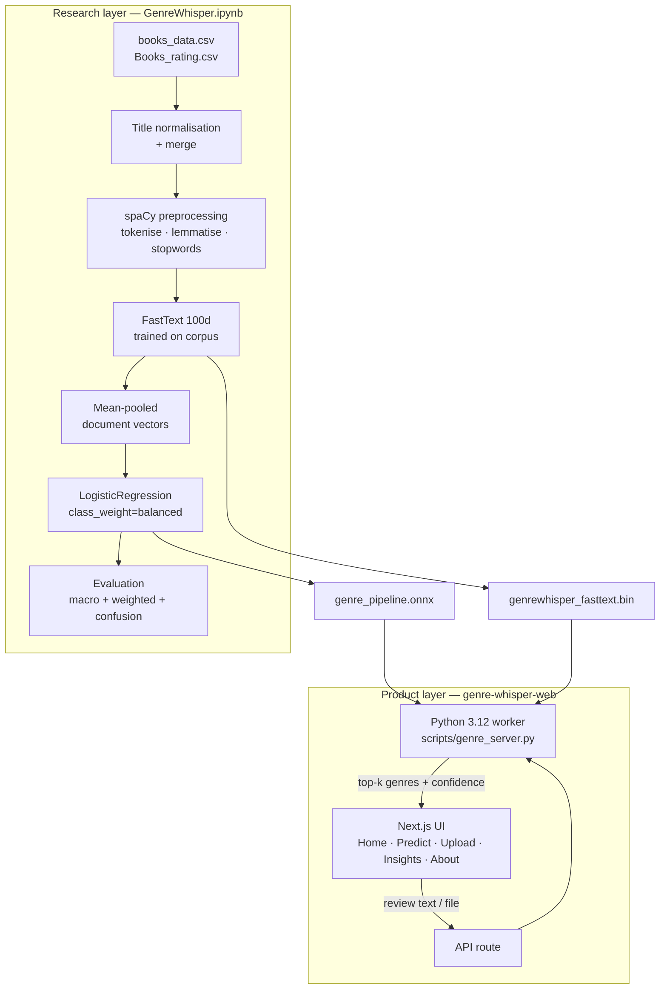

<div align="center">

# 📖 GenreWhisper

### Unveiling hidden genres from the whispers of readers

*Can reader reviews alone recover a book's genre — and does review language expose systematic sentiment bias across genres?*

<br/>

[](https://python.org)
[](https://spacy.io)
[](https://scikit-learn.org)
[](https://onnx.ai)
[](https://nextjs.org)
[](https://threejs.org)

[](#-the-nlp-pipeline)
[-orange?style=flat-square)](#-the-nlp-pipeline)
[](#-inference-architecture)
[](#-dataset)

</div>

---

## The question

Most book classification systems trust publisher metadata and storefront categories. GenreWhisper throws that away and asks a harder question:

> **If we ignore the official label and listen only to what readers write, can we still recover the book's genre?**

Reviews are treated as semantic evidence — signals of tone, theme, world-building, and reader expectation. The second half of the project turns the lens around: if genres are recoverable from review language, then review language also *encodes how each genre gets judged*. Some genres attract polarised scores. Some attract longer, richer reviews. Some get systematically dismissed.

The result is two artefacts that share one pipeline: a **research notebook** that builds and evaluates the model, and a **cinematic web product** that makes it usable.

---

## Why this project is worth a look

| | |
|---|---|
| **Embeddings trained from scratch** | Not a pretrained sentence encoder — a custom 100-dimensional FastText model trained on the cleaned review corpus itself, so the vector space is domain-native |
| **Honest metric choice** | `class_weight="balanced"` + macro precision/recall/F1 reported alongside weighted. Accuracy alone would flatter the model on a skewed genre distribution |
| **Real export path** | The trained sklearn pipeline is exported to ONNX and served through `onnxruntime` — not a notebook that only runs on the author's laptop |
| **Bias analysis, not just classification** | The confusion matrix is read as a *finding* about genre taxonomy overlap, not just an error report |
| **Product layer** | A Next.js front-end with real inference, file upload, and 3D scene work — the model ships to a UI instead of ending at `plt.show()` |

---

## 🏗️ Architecture



---

## 🔬 The NLP pipeline

<details open>
<summary><b>1 — Dataset</b></summary>

<br/>

**Amazon Books Reviews** (Kaggle).

| File | Fields used |
|---|---|
| `books_data.csv` | `Title`, `description`, `authors`, `categories` |
| `Books_rating.csv` | `Title`, `review/text`, `review/summary`, `review/score` |

Titles are normalised, a primary genre is extracted from `categories`, and the review table is joined to the metadata table. Low-frequency genres are dropped to keep the label space meaningful.

</details>

<details open>
<summary><b>2 — Preprocessing</b></summary>

<br/>

`spaCy` handles tokenisation, lemmatisation, stop-word removal, and punctuation stripping. Lemmatisation matters here: review vocabulary is inflection-heavy and collapsing forms tightens the FastText vector space.

</details>

<details open>
<summary><b>3 — Embeddings</b></summary>

<br/>

A **custom 100-dimensional FastText model** is trained on the cleaned corpus. Each review becomes a document vector by mean-pooling its token vectors.

FastText over word2vec is deliberate — subword information handles the misspellings, invented compounds, and fandom jargon that appear constantly in real reviews.

</details>

<details open>
<summary><b>4 — Classifier and evaluation</b></summary>

<br/>

`LogisticRegression` with `class_weight="balanced"`.

Reported metrics:

| Metric | Why it's here |
|---|---|
| Precision / Recall / **F1 (macro)** | Whether minority genres are handled fairly |
| Precision / Recall / F1 (weighted) | Real-world performance on the actual distribution |
| Confusion matrix | *Which* genres the model conflates — a finding about taxonomy overlap, not just an error |

> 📌 Fill in your final scores from the notebook here — a results table is the single highest-value thing a reviewer looks for:
>
> | | Precision | Recall | F1 |
> |---|---:|---:|---:|
> | **Macro** | — | — | — |
> | **Weighted** | — | — | — |

</details>

---

## ⚙️ Inference architecture

Real inference runs end to end. The browser sends review text or extracted file content to a Next.js API route, which calls a persistent Python 3.12 worker. The worker preprocesses with spaCy, vectorises with the FastText binary, runs `genre_pipeline.onnx`, and returns ranked genres with confidence scores.

**Why server-side:** `genrewhisper_fasttext.bin` is roughly **810 MB**. Browser-only inference is not viable at that size, and it exceeds what a standard serverless function will hold.

<details>
<summary><b>Deployment reality check</b> — read before deploying</summary>

<br/>

| Layer | Vercel-deployable? |
|---|---|
| Website shell, static pages, 3D scenes | ✅ Yes |
| Insights and research presentation | ✅ Yes |
| Full real inference (Python worker + 810 MB FastText) | ❌ No |

The honest options:

1. **Split hosting** — Vercel for the front-end, the Python worker on Railway / Render / Fly.io / a VPS.
2. **Shrink the pipeline** — re-export a quantised or reduced-dimension text pipeline small enough for serverless. This is the better long-term fix.

</details>

---

## 🖥️ The web product

| Route | What it does |
|---|---|
| `/` | Cinematic landing page — floating 3D book, gold-lit vintage-library visual language |
| `/predict` | Paste a review, run real genre prediction through the exported pipeline |
| `/upload` | Upload `.txt`, `.csv`, `.json`, or `.pdf` — text is extracted and classified |
| `/insights` | The project's analytical findings in a product-facing layout |
| `/about` | Ties notebook, model, and methodology together |

> 🖼️ **Add screenshots here.** This project is visually distinctive and the README currently doesn't show it. Drop 2–3 captures into `docs/` and reference them — it's the fastest quality win available on this repo.

<details>
<summary><b>Design language</b></summary>

<br/>

GenreWhisper was deliberately not designed like a generic AI dashboard. The direction is vintage library: leather and parchment textures, antique gold accents, editorial typography, cinematic transitions, a floating open-book hero. The visual identity is part of the argument the project makes, not decoration on top of it.

</details>

---

## 🚀 Running locally

<details open>
<summary><b>Web app</b></summary>

```bash
cd genre-whisper-web
npm install
npm run build -- --webpack
npm run start -- --hostname 127.0.0.1 --port 3005
```

Then open `http://127.0.0.1:3005`.

</details>

<details open>
<summary><b>Python worker</b></summary>

<br/>

Real inference requires Python 3.12. Point the app at your interpreter:

```bash
# macOS / Linux
export GENREWHISPER_PYTHON="/usr/bin/python3.12"

# Windows PowerShell
$env:GENREWHISPER_PYTHON="C:\path\to\python312\python.exe"
```

Set this before starting the app. Without it, the UI still builds but predictions will not run.

</details>

<details>
<summary><b>Required model artefacts</b> — gitignored, generate from the notebook</summary>

<br/>

| File | Produced by |
|---|---|
| `genrewhisper_fasttext.bin` | FastText training cell |
| `genre_pipeline.onnx` | ONNX export cell |
| `genre_classifier.onnx` | ONNX export cell |
| `genre_scaler.onnx` | ONNX export cell |
| `genre_labels.json` | Label encoder export |
| `genrewhisper_metadata.json` | Pipeline metadata export |

These are excluded from git because they are large or environment-specific. Run `GenreWhisper.ipynb` end to end to regenerate them.

</details>

---

## 📁 Structure

```
GenreWhisper/
├── GenreWhisper.ipynb                 # Research notebook — full pipeline
├── generate_notebook.py               # Notebook generator
├── GenreWhisper_Technical_Brief.md    # Methodology write-up
├── GenreWhisper_Technical_Brief.pdf
├── build_technical_pdf.py
├── implementation_plan.md
└── genre-whisper-web/
    ├── src/app/
    │   ├── page.tsx                   # Landing
    │   ├── predict/  upload/          # Real inference routes
    │   ├── insights/ about/
    │   └── api/                       # Worker bridge
    └── scripts/
        ├── genre_server.py            # Persistent Python inference worker
        └── extract_pdf_text.py        # PDF text extraction
```

---

## ⚠️ Limitations

<details>
<summary><b>Stated honestly</b></summary>

<br/>

- **Genre labels are noisy.** Amazon `categories` are crowd- and publisher-assigned, inconsistent, and often overlapping. The model's ceiling is partly the taxonomy's ceiling.
- **Reviews carry reviewer bias, not just genre signal.** Demographics and platform dynamics are baked into the corpus and are not controlled for.
- **The bias findings are correlational.** "Genre X attracts more polarised language" describes this dataset; it is not a claim about readers in general.
- **Model size blocks clean deployment.** See the deployment reality check above.

</details>

---

## 🛠️ Stack

**NLP / ML** · spaCy · FastText · scikit-learn · ONNX · onnxruntime · pandas · NumPy · matplotlib · Plotly
**Web** · Next.js 16 · React 19 · TypeScript · Tailwind CSS 4 · GSAP · Three.js · @react-three/fiber · @react-three/drei · Framer Motion · lucide-react

---

<div align="center">

**Ahcene Zakaria Aouanouk** — Data Science & AI student, Algiers

[](https://www.linkedin.com/in/ahcene-zakaria-aouanouk-1126902b7/)
[](mailto:zzaouanouk@gmail.com)

</div>
